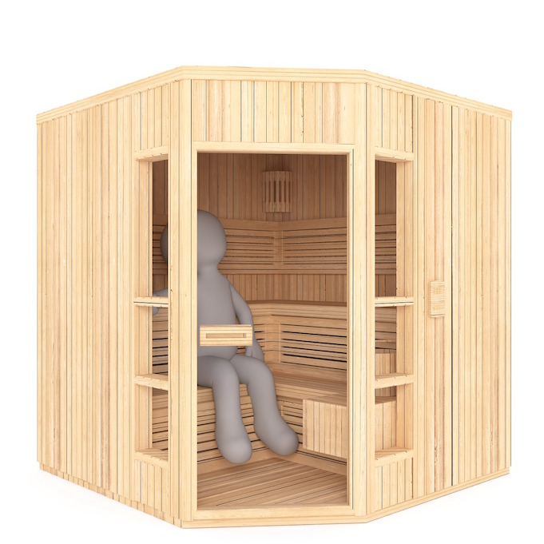

# Sauna
### React SPA Boilerplate



#### Including
* Webpack Dev Server
* Hot Module Reloading
* CSS Modules w/ SASS transpilation
* ES6 transpilation via Babel

#### Installation
```
    git clone https://github.com/cpachomski/Universe.git
    cd Universe && yarn
 ```
 
 #### Development
 
 ```
    yarn start
 ```
* Webpack will open up a window in your default browser. You are now good to go. Build something. Do something. It will reload automatically. Enjoy this.
 
 #### Production
 ```
    yarn build
```
 * Webpack will compile and bundle your applcation and assets into /dist and you can do whatever you want with it.
 


 

